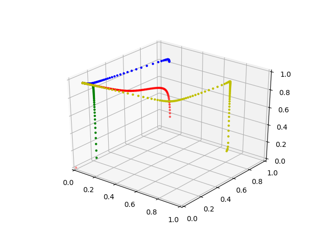
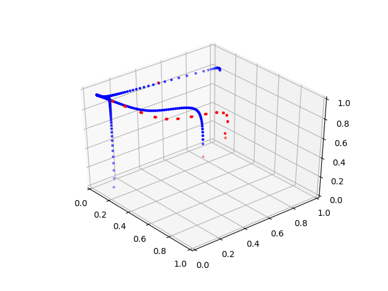

# AffineScaling
Linear Programming Optimization, Interior Point method

Reference textbook: [Introduction to Linear Optimization](http://www.athenasc.com/linoptbook.html)  

Here we implemented two interior methods:  

```AffineScaling.py``` is a implementation of the affine scaling, or so called interior point method illustrated in Section 9.1 of the textbook  

```PrimalDualPathFollowing.py``` is a implementation of the Primal Dual Path Following method in Section 9.5 of textbook  

```spanningLP.py``` is tools for the Exercise 9.5 and Example 9.10 of the textbook

Affine Scaling Algorithm Path Visualization  
  

Comparison between AffineScaling(blue) and PrimalDualPathFollowing(red)  


